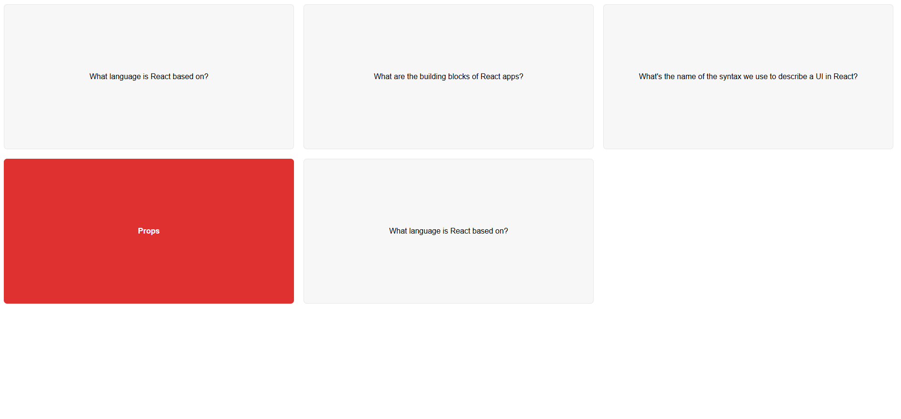

## ⭐ React FlashCards Challenge ⭐

A simple React project that displays a **set of flashcards with questions and answers.**   This project helps **practice React fundamentals** by creating interactive flashcards that allow users to **reveal answers by clicking on each card**. Perfect for anyone looking to improve their React skills!

# Getting Started with Create React App

This project was bootstrapped with [Create React App](https://github.com/facebook/create-react-app).

## Available Scripts

In the project directory, you can run:

### `npm start`

Runs the app in the development mode.\
Open [http://localhost:3000](http://localhost:3000) to view it in your browser.

The page will reload when you make changes.\
You may also see any lint errors in the console.

## 📌 Tech Stack

 

## Output:

## 📌 My process

- I started Udemy Course "The Ultimate React Course 2024 React, Redux & More" by Jonas Schmedtmann.<a href="" target="_blank"> **Check🚀 (Not Sponsered)**</a>
- I feel confident while writing REACT 👊.
- Developed understanding in creating components, managing state, and handling events in React.
- Practiced React Hooks such as useState for interactive UI functionality.

## 📌 What I Learn

👉 How to create and use React Components.  
👉 Passing data between components using Props.  
👉 Conditional rendering with JSX.  
👉 Using React Hooks like useState for dynamic interactions.

## 📬 Connect With Me

- **LinkedIn** - [Lawal Yusuf](https://www.linkedin.com/in/lawal-owolabi-yusuf-04976b143)
